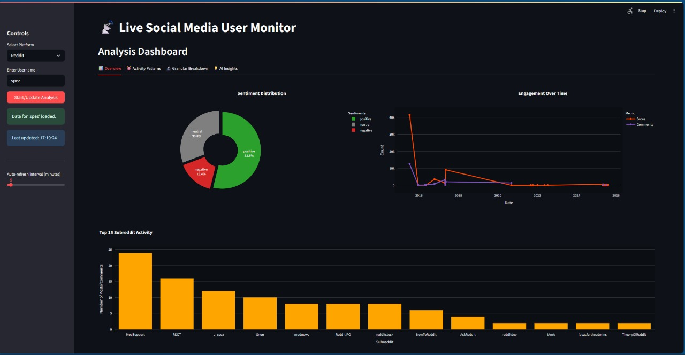
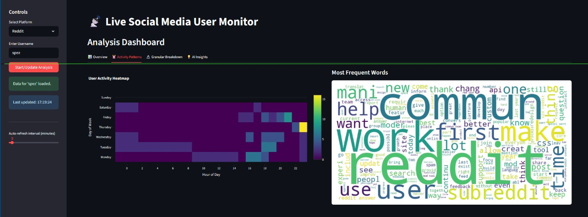
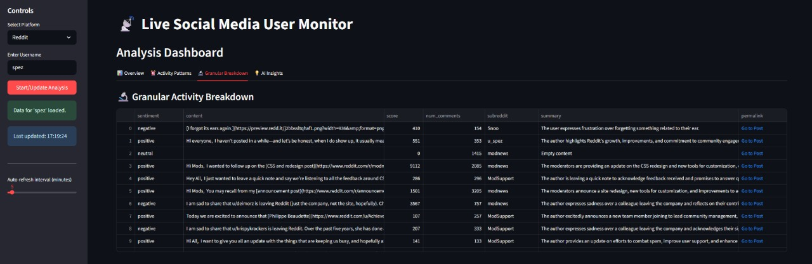
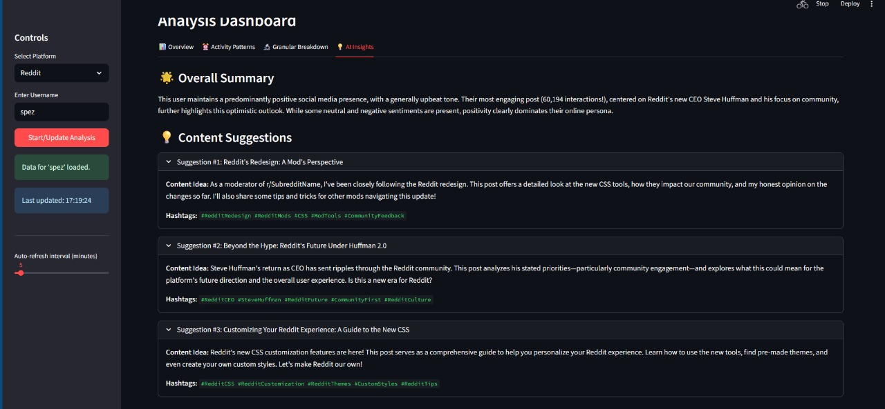

# Digital Footprint Profiler & Smart Content Advisor

🔗 **GitHub Repository:**  
https://github.com/Kalpesh47d/Digital-Footprint-Profiler-and-Smart-Content-Advisor

---

## 📌 Project Overview
The **Digital Footprint Profiler & Smart Content Advisor** is an AI-powered analytics system designed to scrape, analyze, and visualize social media content from multiple platforms.

The application collects data from **X, Reddit, and Instagram**, processes it through a scalable streaming pipeline, applies **LLM-based analysis**, and presents insights via an interactive dashboard built with Streamlit.

---

## 🚀 Key Features
- 🔍 Automated scraping of social media data using **Selenium**
- 🧠 Content analysis using **Large Language Models (LLMs)**
- 📊 Sentiment, trend, and engagement analysis
- 🧩 Real-time data ingestion using **Apache Kafka**
- 🗄️ Storage of structured and unstructured data in **MongoDB**
- 📈 Interactive data visualization using **Streamlit**
- 🐳 Containerized deployment with **Docker**

---

## 🛠️ Tech Stack
- **Programming Language:** Python  
- **Web Scraping:** Selenium  
- **Streaming Platform:** Apache Kafka  
- **Database:** MongoDB  
- **AI/NLP:** Large Language Models (LLMs)  
- **Dashboard:** Streamlit  
- **Containerization:** Docker  

---

## ⚙️ System Workflow
- Social media data is scraped from X, Reddit, and Instagram
- Scraped data is streamed using Kafka producers
- Kafka consumers store processed data in MongoDB
- LLMs analyze content for insights and recommendations
- Results are displayed through a Streamlit dashboard

---

## 📷  Results

### 🔹 Page 1


### 🔹 Page 2


### 🔹 Page 3


### 🔹 Page 4

---

## ⚙️ Installation & Setup

- Clone the repository
```bash
git clone https://github.com/Kalpesh47d/Digital-Footprint-Profiler-and-Smart-Content-Advisor.git
cd Digital-Footprint-Profiler-and-Smart-Content-Advisor
```


## ⚙️ Install required dependencies

```bash
pip install -r requirements.txt
```

## Start Kafka and MongoDB using Docker

```bash
docker compose up -d
```

## Run the Streamlit 

```bash
streamlit run analysis.py
```

## 🔐 Environment Variables (.env Setup)

This project uses external services such as Google Gemini API, Kafka, and MongoDB.
The .env file is not included in the repository for security reasons.

Create a .env file in the project root
```bash
touch .env
```

Add the following variables to .env
```bash
# Google Gemini API Key
GEMINI_API_KEY=your_gemini_api_key_here

# Kafka Configuration
KAFKA_BOOTSTRAP_SERVERS=localhost:9092
KAFKA_TOPIC=social_media_stream

# MongoDB Configuration
MONGODB_URI=mongodb://localhost:27017
MONGODB_DATABASE=digital_footprint_db
```

⚠️ Do NOT commit .env to GitHub